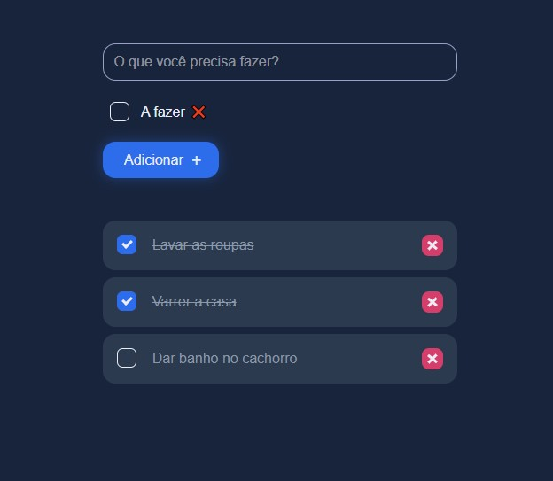

<!---->
<div align="center">

</div>

# ToDoList - Aplicativo de tarefas criado com HTML, CSS e JS

<p>Esse projeto foi feito por: <strong>Thiago Silva Lopes</strong>, em 05/2021,</br>
tendo como base, as aulas de ECMAScript6+, no Basecamp gratuito da <a href="https://www.cataline.io/basecamp">Cataline</a>

## Demo: https://todo-list-cataline.vercel.app

### ⚠ Esse projeto possui um API separada do aplicativo❗❗❗ Sendo assim, caso queira rodar esse app localmente, clone a API no repositório:

https://github.com/Thiagoow/API-JsonServer-ToDoList-ThiagoSilvaLopes </br>
<small align="center">( E mude a "baseURL:" em "src/utils/", para: "http://localhost:3000" ) </small>

##### 1º - Instalar o projeto localmente, com a pasta "node_modules":

```
yarn install
```

##### 2º - Compilar/executar o projeto localmente:

```
yarn dev
```

<small>© Thiago Silva Lopes </small>
